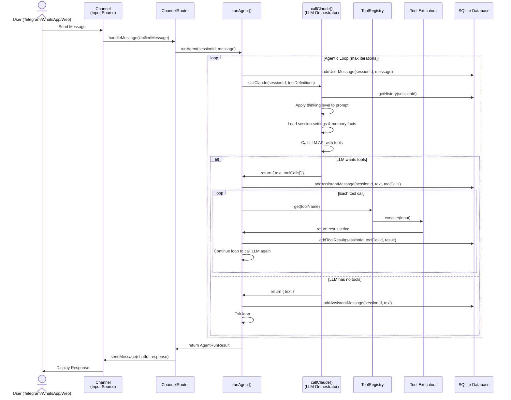
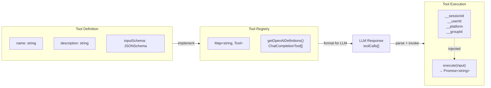
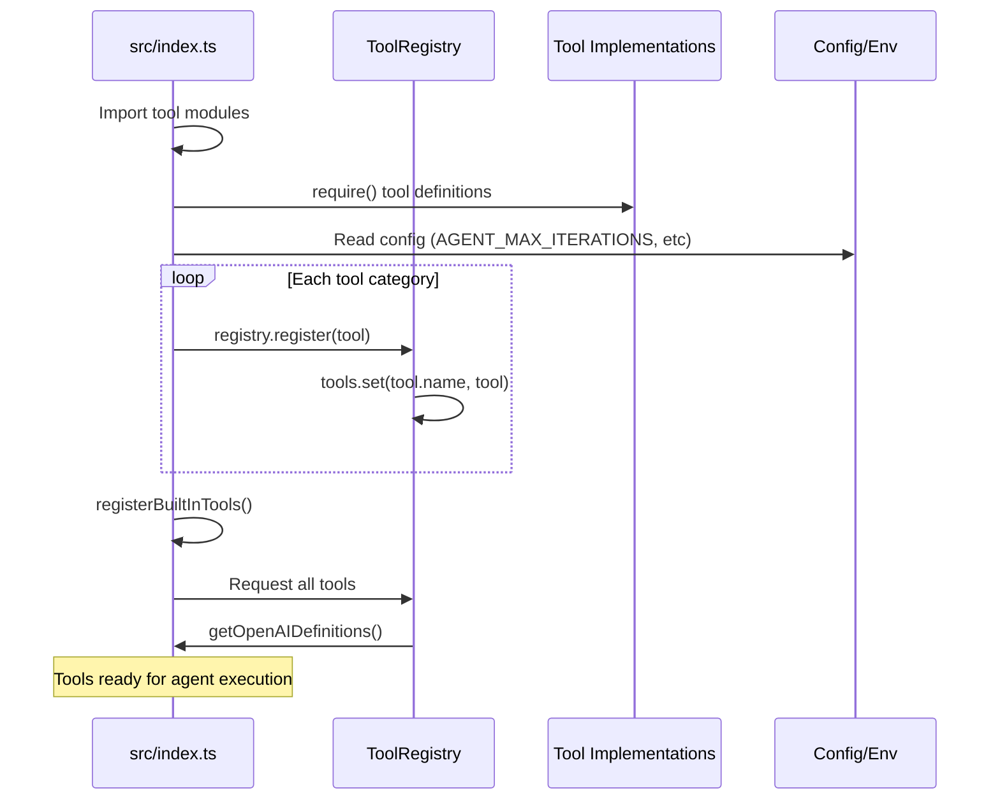
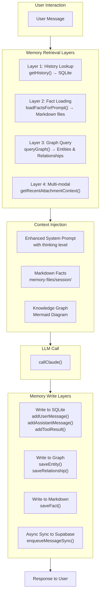
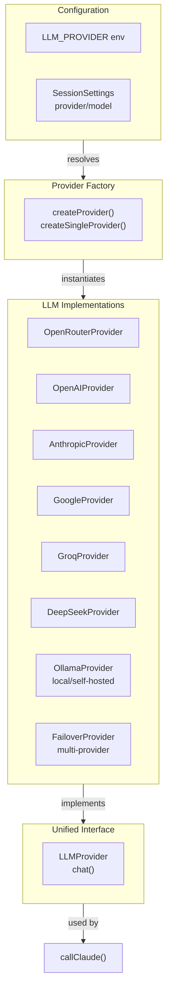

# Gravity Claw Architecture Documentation

Gravity Claw is a sophisticated personal AI agent with multi-channel communication capabilities. This document provides a detailed overview of the system architecture, design patterns, and extension points.

## Table of Contents

1. [Request Flow](#request-flow)
2. [High-Level Component Architecture](#high-level-component-architecture)
3. [Database Schema](#database-schema)
4. [Tool System](#tool-system)
5. [Memory Architecture](#memory-architecture)
6. [LLM Provider System](#llm-provider-system)
7. [Architectural Decisions](#architectural-decisions)
8. [Extension Points](#extension-points)

---

## Request Flow

The request flow forms the core of Gravity Claw's agentic loop, where user messages are processed through multiple stages with iterative tool invocation.



### Request Flow Details

| Stage | Component | Responsibility | Key Files |
|-------|-----------|-----------------|-----------|
| **Reception** | Channel (Telegram/WhatsApp/WebChat) | Receive message from external source | `src/channels/*.ts` |
| **Routing** | ChannelRouter | Route message to agent, manage confirmations | `src/channels/router.ts` |
| **Agentic Loop** | runAgent() | Orchestrate tool calls and LLM interaction | `src/agent.ts` |
| **History Management** | SQLite + History functions | Persist conversation state | `src/db.ts`, `src/llm/orchestrator.ts` |
| **LLM Orchestration** | callClaude() | Call LLM with context, thinking, and memory | `src/llm/orchestrator.ts` |
| **Tool Execution** | ToolRegistry + Tools | Execute requested tools and collect results | `src/tools/index.ts` |
| **Response** | Channel | Send response back to user | `src/channels/*.ts` |

**Maximum Iterations:** Controlled by `AGENT_MAX_ITERATIONS` config (prevents infinite loops)

---

## High-Level Component Architecture

Gravity Claw's architecture is composed of several interconnected subsystems that communicate through well-defined interfaces.

```mermaid
graph TB
    subgraph Channels["Input Channels"]
        TG["Telegram Channel"]
        WA["WhatsApp Channel"]
        WEB["WebChat Channel"]
    end
    
    subgraph Core["Core Agent Loop"]
        CR["ChannelRouter"]
        RA["runAgent()"]
        LC["callClaude(LLM Orchestrator)"]
    end
    
    subgraph "Tool System"
        TR["ToolRegistry"]
        Tools["Tool Implementations"]
    end
    
    subgraph Memory["Memory System"]
        SQLite["SQLite<br/>conversation_history<br/>settings<br/>facts"]
        Graph["Knowledge Graph<br/>entities<br/>relationships"]
        Markdown["Markdown Facts<br/>memory-files/"]
        Supabase["Supabase Sync<br/>optional async"]
    end
    
    subgraph LLMProviders["LLM Provider Layer"]
        OpenRouter["OpenRouter"]
        OpenAI["OpenAI"]
        Anthropic["Anthropic"]
        Google["Google Gemini"]
        Groq["Groq"]
        DeepSeek["DeepSeek"]
        Ollama["Ollama (Local)"]
        Failover["Failover Provider"]
    end
    
    subgraph Extensions["Extensions & Plugins"]
        MCP["MCP Servers"]
        Skills["Skills System"]
        Plugins["Plugin Registry"]
    end
    
    Channels -->|UnifiedMessage| CR
    CR -->|runAgent()| RA
    RA -->|callClaude()| LC
    LC -->|resolve history + memory| Memory
    LC -->|get provider| LLMProviders
    RA -->|get tools| TR
    TR -->|execute| Tools
    Tools -->|write/read| Memory
    Extensions -->|register tools| TR
    Memory -->|sync| Supabase
```

### Component Responsibilities

| Component | Purpose | Key Exports |
|-----------|---------|-------------|
| **Channels** | Handle input/output for different platforms | `Channel.start()`, `Channel.sendMessage()` |
| **ChannelRouter** | Multiplex across channels, handle cross-cutting concerns | `handleMessage()`, `startAll()`, `stopAll()` |
| **runAgent()** | Main agentic loop (request → LLM → tools → repeat) | `AgentRunOptions`, `AgentRunResult` |
| **callClaude()** | LLM API orchestration with memory/thinking/settings | `LLMResponse`, `llm/orchestrator.ts` |
| **ToolRegistry** | Map-based tool discovery and execution | `register()`, `get()`, `getOpenAIDefinitions()` |
| **Memory System** | Multi-layered conversation history and knowledge store | `getHistory()`, `saveEntity()`, `loadFacts()` |
| **LLM Providers** | Abstraction over different LLM APIs | `LLMProvider` interface, `createProvider()` |

---

## Database Schema

Gravity Claw uses **SQLite 3** with **WAL (Write-Ahead Logging)** mode for optimal concurrency and persistence.

### Core Tables

#### 1. `memory` — Conversation History
Stores all messages (user, assistant, tool results) as JSON for each session.

```sql
CREATE TABLE memory (
    id INTEGER PRIMARY KEY AUTOINCREMENT,
    session_id TEXT NOT NULL,
    timestamp DATETIME DEFAULT CURRENT_TIMESTAMP,
    message_json TEXT NOT NULL,          -- JSON: ChatCompletionMessageParam
    settings TEXT DEFAULT '{}'           -- JSON: SessionSettings (per-session)
);
CREATE INDEX idx_session_id ON memory(session_id);
```

**Message Types Stored (as JSON):**
- User messages: `{ role: "user", content: string }`
- Assistant messages: `{ role: "assistant", content: string, tool_calls?: [...] }`
- Tool results: `{ role: "tool", tool_call_id: string, content: string }`
- System messages: `{ role: "system", content: string }`

**Settings Column** — Per-session configuration (override global config):
```json
{
  "provider": "openai",
  "model": "gpt-4",
  "thinkingLevel": "medium",
  "voiceMode": "full",
  "ttsProvider": "elevenlabs",
  "temperature": 0.7,
  "maxTokens": 4096,
  "customSystemPrompt": "..."
}
```

---

#### 2. `entities` & `relationships` — Knowledge Graph
In-memory knowledge graph for semantic relationships and fact tracking.

```sql
CREATE TABLE entities (
    id INTEGER PRIMARY KEY AUTOINCREMENT,
    session_id TEXT NOT NULL,
    name TEXT NOT NULL,
    type TEXT NOT NULL,
    properties TEXT DEFAULT '{}',        -- JSON: arbitrary properties
    access_count INTEGER DEFAULT 0,
    last_accessed DATETIME,
    created_at DATETIME DEFAULT CURRENT_TIMESTAMP,
    updated_at DATETIME DEFAULT CURRENT_TIMESTAMP,
    UNIQUE(session_id, name)
);

CREATE TABLE relationships (
    id INTEGER PRIMARY KEY AUTOINCREMENT,
    session_id TEXT NOT NULL,
    from_id INTEGER NOT NULL,
    to_id INTEGER NOT NULL,
    relation_type TEXT NOT NULL,
    metadata TEXT DEFAULT '{}',          -- JSON: relation metadata
    created_at DATETIME DEFAULT CURRENT_TIMESTAMP,
    FOREIGN KEY(from_id) REFERENCES entities(id) ON DELETE CASCADE,
    FOREIGN KEY(to_id) REFERENCES entities(id) ON DELETE CASCADE
);
```

**Usage Example:**
- Entity: `{ name: "Alice", type: "person", properties: { age: 30 } }`
- Relationship: `{ from: alice_id, to: bob_id, relation_type: "knows" }`

---

#### 3. `fact_stats` — Markdown Fact Tracking
Tracks access statistics and importance of persisted markdown facts.

```sql
CREATE TABLE fact_stats (
    session_id TEXT NOT NULL,
    fact_hash TEXT NOT NULL,
    fact_text TEXT NOT NULL,
    category TEXT NOT NULL,
    access_count INTEGER DEFAULT 0,
    last_accessed DATETIME,
    importance REAL DEFAULT 0,
    created_at DATETIME DEFAULT CURRENT_TIMESTAMP,
    updated_at DATETIME DEFAULT CURRENT_TIMESTAMP,
    PRIMARY KEY (session_id, fact_hash)
);
```

---

#### 4. Multi-Agent Orchestration Tables

##### `agent_swarms`
Tracks spawned sub-agents (role-based parallel execution).

```sql
CREATE TABLE agent_swarms (
    id TEXT PRIMARY KEY,
    parent_session TEXT NOT NULL,
    child_session TEXT NOT NULL,
    role TEXT NOT NULL,
    status TEXT NOT NULL DEFAULT 'spawned',
    created_at TIMESTAMP NOT NULL
);
```

##### `workflows` & `workflow_tasks`
Tracks DAG-based workflow decomposition and task execution.

```sql
CREATE TABLE workflows (
    id TEXT PRIMARY KEY,
    session_id TEXT NOT NULL,
    goal TEXT NOT NULL,
    tasks_json TEXT NOT NULL,
    status TEXT NOT NULL DEFAULT 'pending',
    progress REAL NOT NULL DEFAULT 0,
    created_at TIMESTAMP NOT NULL,
    completed_at TIMESTAMP
);

CREATE TABLE workflow_tasks (
    id TEXT PRIMARY KEY,
    workflow_id TEXT NOT NULL,
    task_id TEXT NOT NULL,
    description TEXT NOT NULL,
    depends_on TEXT NOT NULL DEFAULT '[]',
    status TEXT NOT NULL DEFAULT 'pending',
    result TEXT,
    created_session_id TEXT,
    FOREIGN KEY (workflow_id) REFERENCES workflows(id)
);
```

---

#### 5. Inter-Agent Communication Tables

##### `sessions`
Manages session metadata and communication permissions.

```sql
CREATE TABLE sessions (
    id TEXT PRIMARY KEY,
    allow_messages INTEGER DEFAULT 0,
    created_at DATETIME DEFAULT CURRENT_TIMESTAMP,
    updated_at DATETIME DEFAULT CURRENT_TIMESTAMP
);
```

##### `messages`
Stores inter-agent communication.

```sql
CREATE TABLE messages (
    id TEXT PRIMARY KEY,
    from_session_id TEXT NOT NULL,
    to_session_id TEXT NOT NULL,
    content TEXT NOT NULL,
    timestamp DATETIME NOT NULL,
    FOREIGN KEY (from_session_id) REFERENCES sessions(id),
    FOREIGN KEY (to_session_id) REFERENCES sessions(id)
);
```

##### `permissions`
Fine-grained access control between sessions.

```sql
CREATE TABLE permissions (
    id TEXT PRIMARY KEY,
    session_id TEXT NOT NULL,
    target_session_id TEXT NOT NULL,
    can_read INTEGER DEFAULT 0,
    can_write INTEGER DEFAULT 0,
    created_at DATETIME NOT NULL,
    FOREIGN KEY (session_id) REFERENCES sessions(id),
    FOREIGN KEY (target_session_id) REFERENCES sessions(id),
    UNIQUE(session_id, target_session_id)
);
```

---

#### 6. Scheduler & Heartbeat Tables

##### `scheduled_tasks`
Manages recurring tasks and cron jobs.

```sql
CREATE TABLE scheduled_tasks (
    id INTEGER PRIMARY KEY AUTOINCREMENT,
    name TEXT NOT NULL,
    cron TEXT NOT NULL,
    handler_key TEXT NOT NULL,
    enabled INTEGER DEFAULT 1,
    created_at DATETIME DEFAULT CURRENT_TIMESTAMP
);
```

##### `heartbeat_tasks`
Proactive periodic checks per session.

```sql
CREATE TABLE heartbeat_tasks (
    id INTEGER PRIMARY KEY AUTOINCREMENT,
    session_id TEXT NOT NULL,
    interval_minutes INTEGER NOT NULL CHECK(interval_minutes > 0),
    prompt TEXT NOT NULL,
    last_run DATETIME,
    scheduled_task_id INTEGER NOT NULL UNIQUE,
    enabled INTEGER DEFAULT 1,
    created_at DATETIME DEFAULT CURRENT_TIMESTAMP,
    FOREIGN KEY (scheduled_task_id) REFERENCES scheduled_tasks(id) ON DELETE CASCADE
);
```

---

### Database Connection & WAL Mode

```typescript
// From src/db.ts
import Database from "better-sqlite3";

export const db = new Database(dbPath);
db.pragma("journal_mode = WAL");  // Write-Ahead Logging for concurrency
```

**Why WAL?**
- Better concurrent read/write access
- Faster commits for individual transactions
- Reduced lock contention in multi-agent scenarios

---

## Tool System

The tool system is the execution layer where agents invoke external functionality.

### Tool Architecture



### Tool Interface

Every tool must implement the `Tool` interface:

```typescript
// src/types/tools.ts
interface Tool {
  name: string;
  description: string;
  inputSchema: {
    type: "object";
    properties?: Record<string, unknown>;
    required?: string[];
  };
  execute(input: Record<string, unknown>): Promise<string>;
}
```

**Execution Contract:**
- All tools return **strings** (structured responses use `JSON.stringify()`)
- The `input` object always includes context fields:
  - `__sessionId` — Current session identifier
  - `__userId` — Optional user identifier
  - `__platform` — Channel name (e.g., "telegram")
  - `__groupId` — Optional group identifier
  - `__isGroup` — Boolean flag for group chats

### Tool Registration Flow



### Tool Categories

| Category | File Location | Examples |
|----------|---------------|----|
| **Core** | `src/tools/core/` | spawn-agent, aggregate-results, communication |
| **Memory** | `src/tools/memory/` | save-fact, recall-facts, query-graph, search-memory |
| **Voice** | `src/tools/voice/` | transcribe, speak, set-voice, wake-word, talk-mode |
| **System** | `src/tools/system/` | datetime, shell, file-operations, search-attachments |
| **Automation** | `src/tools/automation/` | browser-tools (click, navigate, evaluate) |
| **UI** | `src/tools/ui/` | dashboard-tools, ui-admin-tools |
| **Scheduler** | `src/scheduler/` | create-task, list-tasks, update-task |
| **Webhooks** | `src/webhooks/` | register-webhook, trigger-webhook |

### Tool Response Patterns

**Text Response:**
```typescript
return "Operation completed successfully.";
```

**Structured Response (JSON):**
```typescript
return JSON.stringify({
  success: true,
  data: { /* ... */ },
  message: "Operation completed"
});
```

**Error Response:**
```typescript
return JSON.stringify({
  success: false,
  error: "Description of error",
  code: "ERROR_CODE"
});
```

---

## Memory Architecture

Gravity Claw implements a **hybrid multi-layer memory system** combining SQLite, in-process knowledge graphs, and optional cloud sync.



### Memory Layers

#### 1. SQLite Conversation History
- **File:** `src/llm/orchestrator.ts`
- **Function:** `getHistory(sessionId)` → `ChatCompletionMessageParam[]`
- **Purpose:** Sequential conversation tracking for in-context learning
- **Storage:** `memory` table (message_json column)

```typescript
function getHistory(sessionId: string): ConversationHistory {
    const rows = db.prepare(
        "SELECT message_json FROM memory WHERE session_id = ? ORDER BY timestamp ASC, id ASC"
    ).all(sessionId);
    return rows.map(row => JSON.parse(row.message_json));
}
```

#### 2. Knowledge Graph (In-Process)
- **File:** `src/memory/graph.ts`
- **Tables:** `entities`, `relationships`
- **Functions:**
  - `saveEntity()` — Create/update entity
  - `saveRelationship()` — Create entity relationship
  - `queryGraph()` — Query entities and relationships
  - `formatGraphAsMermaid()` — Visualize as diagram
- **Purpose:** Semantic entity and relationship tracking

```typescript
// Example: Store relationships
saveEntity(sessionId, "Alice", "person", { age: 30 });
saveEntity(sessionId, "Bob", "person", { age: 28 });
saveRelationship(sessionId, "Alice", "Bob", "knows");

// Query and format
const graph = queryGraph(sessionId);
const mermaidDiagram = formatGraphAsMermaid(graph);
```

#### 3. Markdown Persistent Facts
- **File:** `src/memory/markdown.ts`
- **Storage:** `memory-files/{sessionId}/facts.md`
- **Functions:**
  - `saveFact(sessionId, category, fact)` — Persist facts to disk
  - `loadFactsForPrompt(sessionId)` — Load facts for inclusion in system prompt
  - `touchFactAccess()` — Track fact usage statistics
- **Purpose:** Long-term knowledge base injected into every prompt

```typescript
// Save a fact
saveFact("telegram:12345", "preferences", "User prefers coffee over tea");

// Facts are loaded and injected:
const facts = loadFactsForPrompt(sessionId);
// Result: "## Preferences\n- User prefers coffee over tea"
```

#### 4. Optional Supabase Cloud Sync
- **File:** `src/memory/supabase.ts`
- **Function:** `enqueueMessageSync()` — Async, non-blocking
- **Purpose:** Optional cloud backup of conversation history

```typescript
// Async queue-based sync (non-blocking)
enqueueMessageSync({ sessionId, role: "user", content: text });
```

### Memory Fact System

Facts are managed with:
- **SHA1 hashing** to avoid duplicates
- **Access count & importance tracking** in `fact_stats` table
- **Threading** for background sync
- **Markdown organization** by category

```typescript
// saveFact() writes to disk and updates fact_stats
saveFact(sessionId, "work", "Use React for frontend projects");

// Facts are auto-loaded during prompt construction
const prompt = loadFactsForPrompt(sessionId);
// Generates markdown section with all facts grouped by category
```

---

## LLM Provider System

Gravity Claw supports multiple LLM providers with a unified interface, provider switching, and failover capabilities.



### Supported Providers

| Provider | API Key | Default Model | Use Case |
|----------|---------|---|----------|
| **OpenRouter** | `OPENROUTER_API_KEY` | `claude-3-5-sonnet` | Multi-model routing, cost optimization |
| **OpenAI** | `OPENAI_API_KEY` | `gpt-4o` | Production-grade, fine-tuning |
| **Anthropic** | `ANTHROPIC_API_KEY` | `claude-3-5-sonnet` | Direct Anthropic access |
| **Google** | `GOOGLE_API_KEY` | Gemini 2.0 | Google Cloud integration |
| **Groq** | `GROQ_API_KEY` | Mixtral-8x7b | Low-latency inference |
| **DeepSeek** | `DEEPSEEK_API_KEY` | DeepSeek-V3 | Cost-effective reasoning |
| **Ollama** | Local endpoint | Llama 2 | Self-hosted, air-gapped |
| **Failover** | Multiple keys | Dynamic | High availability |

### Provider Selection

**Global Default (via `src/config.ts`):**
```typescript
const LLM_PROVIDER = "openrouter";  // default
const LLM_MODEL = "claude-3-5-sonnet";
```

**Session Override (via `setSessionSettings()`):**
```typescript
setSessionSettings(sessionId, {
  provider: "openai",
  model: "gpt-4",
  temperature: 0.8,
  maxTokens: 2048
});
```

### Failover Provider

The `FailoverProvider` automatically tries multiple providers in sequence, enabling high availability:

```typescript
// Configuration
LLM_PROVIDER=failover
LLM_FAILOVER_LIST=openai,anthropic,openrouter

// Behavior
// 1. Try OpenAI
// 2. If fails, try Anthropic
// 3. If fails, try OpenRouter
// All attempts counted, health status tracked
```

---

## Architectural Decisions

### 1. Why SQLite with WAL Mode?

**Decision:** Use SQLite 3 with Write-Ahead Logging (not PostgreSQL or other databases)

**Rationale:**
- **Zero setup:** Embedded database, no separate server process
- **Concurrent access:** WAL mode enables safe concurrent reads
- **Persistence by default:** Conversation history and state always preserved
- **Single file deployment:** Portable, containerizable
- **Good enough scale:** Handles 10K+ sessions without issues
- **JSON columns:** Native support for flexible message schemas

**Trade-offs:**
- Limited to single-machine deployments
- No distributed transactions (acceptable for agent use case)

---

### 2. Why Hybrid Memory System?

**Decision:** Implement multi-layer memory (SQLite history + knowledge graph + markdown facts + optional Supabase sync)

**Rationale:**

| Layer | Purpose | Why Separate |
|-------|---------|--------------|
| **SQLite History** | Sequential conversation context | Fast lookup, ordered retrieval |
| **Knowledge Graph** | Semantic entity relationships | Fast traversal, relationship queries |
| **Markdown Facts** | Durable declarative knowledge | Human-readable, disk-backed, versionable |
| **Supabase** | Cloud backup (optional) | Async, non-blocking, independent of local state |

**Benefits:**
- Different access patterns for different memory types
- Non-blocking cloud sync (doesn't slow down local inference)
- Human-editable facts via markdown files
- Semantic browsing via graph queries

---

### 3. Why Agentic Loop with Thinking Support?

**Decision:** Implement iterative tool-calling loop with optional extended thinking

**Rationale:**
- **Flexibility:** LLM decides whether to use tools or proceed to response
- **Verifiable reasoning:** Extended thinking traces are persisted
- **Efficient context use:** Tool results fed back into conversation history
- **Iteration budgets:** `AGENT_MAX_ITERATIONS` prevents runaway loops

**Thinking Level Support:**
- `off` — No extended thinking (default)
- `low` — Minimal hidden reasoning
- `medium` — Moderate internal reasoning
- `high` — Deep chain-of-thought

---

### 4. Why WebSocket-Based Tool Calls?

**Decision:** Tools are invoked synchronously within the agentic loop (not async/webhook-driven)

**Rationale:**
- **Immediate feedback:** Tool results instantly fed back to LLM context
- **State consistency:** No race conditions between tool invocations
- **Error handling:** Failed tools can be retried in same conversation thread
- **Simpler debugging:** Linear request trace visible in history

**Limitation:**
- Slow tools block the agentic loop
- Mitigation: Long-running tasks spawned as separate agents

---

### 5. Why Multiple Channels with Unified Message Format?

**Decision:** Support Telegram, WhatsApp, WebChat through `UnifiedMessage` abstraction

**Rationale:**
- **Single agent logic:** One `runAgent()` handles all channels
- **Extensibility:** New channels add ~200 LOC by implementing `Channel` interface
- **Session isolation:** Each channel/chat combo gets unique `sessionId`
- **Per-channel customization:** Channel can inject metadata in message

---

### 6. Why Tools are Stateless?

**Decision:** All tool state is stored in SQLite or external services (not in-memory)

**Rationale:**
- **Crash safety:** Agent process restart doesn't lose tool invocation state
- **Distribution ready:** Enables future multi-process agent scaling
- **Debugging:** Tool traces are always persisted and queryable

---

## Extension Points

### Adding a New Tool

**Steps:**

1. **Define the tool** in a category directory (`src/tools/{category}/my-tool.ts`):

```typescript
import type { Tool } from "../../types/tools.js";

export const myTool: Tool = {
  name: "my_tool",
  description: "Brief description of what the tool does",
  inputSchema: {
    type: "object",
    properties: {
      param1: {
        type: "string",
        description: "Description of param1"
      },
      param2: {
        type: "number",
        description: "Description of param2"
      }
    },
    required: ["param1"]
  },
  async execute(input) {
    const { param1, param2, __sessionId } = input;
    
    // Access context injected by framework
    const sessionId = __sessionId as string;
    
    try {
      // Tool logic here
      const result = await doSomething(param1, param2);
      return JSON.stringify({ success: true, data: result });
    } catch (error) {
      return JSON.stringify({
        success: false,
        error: error instanceof Error ? error.message : "Unknown error"
      });
    }
  }
};
```

2. **Export from category index** (`src/tools/{category}/index.ts`):

```typescript
export const myTools = [myTool];
```

3. **Register in main startup** (`src/index.ts`):

```typescript
import { myTools } from "./tools/myCategory/index.ts";

// In main():
myTools.forEach(tool => registry.register(tool));
```

**Example: Simple Calculator Tool**

```typescript
// src/tools/core/calculator.ts
export const calculatorTool: Tool = {
  name: "calculate",
  description: "Perform arithmetic operations (add, subtract, multiply, divide)",
  inputSchema: {
    type: "object",
    properties: {
      operation: {
        type: "string",
        enum: ["add", "subtract", "multiply", "divide"],
        description: "The operation to perform"
      },
      a: { type: "number", description: "First operand" },
      b: { type: "number", description: "Second operand" }
    },
    required: ["operation", "a", "b"]
  },
  async execute(input) {
    const { operation, a, b } = input as {
      operation: string;
      a: number;
      b: number;
    };
    
    let result: number;
    switch (operation) {
      case "add":
        result = a + b;
        break;
      case "subtract":
        result = a - b;
        break;
      case "multiply":
        result = a * b;
        break;
      case "divide":
        if (b === 0) return JSON.stringify({ success: false, error: "Division by zero" });
        result = a / b;
        break;
      default:
        return JSON.stringify({ success: false, error: "Unknown operation" });
    }
    
    return JSON.stringify({ success: true, result });
  }
};
```

---

### Adding a New Channel

**Steps:**

1. **Implement the `Channel` interface** in `src/channels/my-channel.ts`:

```typescript
import type { Channel, UnifiedMessage } from "../types/channels.js";

export class MyChannel implements Channel {
  readonly id = "my-channel";
  private messageHandler?: (msg: UnifiedMessage) => Promise<void>;

  async start(onMessage: (msg: UnifiedMessage) => Promise<void>) {
    this.messageHandler = onMessage;
    // Connect to external service (API polling, WebSocket, etc)
    await this.connectToService();
    console.log("MyChannel started");
  }

  async stop() {
    // Gracefully disconnect
    await this.disconnectFromService();
  }

  async sendMessage(chatId: string, text: string) {
    // Send message back to user
    await this.externalServiceSend(chatId, text);
  }

  private async connectToService() {
    // Implementation details
  }

  private async disconnectFromService() {
    // Implementation details
  }

  private async externalServiceSend(chatId: string, text: string) {
    // Implementation details
  }

  private async receiveFromService(message: any) {
    // Convert external message to UnifiedMessage
    const unified: UnifiedMessage = {
      channelId: this.id,
      chatId: message.from,
      text: message.text,
      timestamp: Date.now(),
      senderId: message.from,
      senderName: message.senderName
    };
    
    if (this.messageHandler) {
      await this.messageHandler(unified);
    }
  }
}
```

2. **Register in main startup** (`src/index.ts`):

```typescript
import { MyChannel } from "./channels/my-channel.ts";

// In main():
const router = new ChannelRouter();
router.register(new TelegramChannel());
router.register(new WhatsAppChannel());
router.register(new WebChatChannel());
router.register(new MyChannel());  // Add new channel
await router.startAll();
```

**Channel Interface:**

```typescript
interface Channel {
  readonly id: string;
  start(onMessage: (msg: UnifiedMessage) => Promise<void>): Promise<void>;
  stop(): Promise<void>;
  sendMessage(chatId: string, text: string): Promise<void>;
}

interface UnifiedMessage {
  channelId: string;
  chatId: string;
  text: string;
  timestamp: number;
  senderId: string;
  senderName?: string;
  mediaUrls?: string[];
  replyTo?: string;
}
```

---

### Adding a New LLM Provider

**Steps:**

1. **Extend `LLMProvider` interface** in `src/llm/my-provider.ts`:

```typescript
import type { LLMProvider, LLMChatOptions, LLMResponse } from "../types/llm.js";

export class MyLLMProvider implements LLMProvider {
  constructor(private apiKey: string, private model: string) {}

  async chat(messages: ChatCompletionMessageParam[], options: LLMChatOptions): Promise<LLMResponse> {
    // Call your LLM API
    const response = await this.callMyAPI(messages, options);
    
    return {
      text: response.text,
      toolCalls: response.toolCalls || [],
      usage: response.usage,
      stopReason: response.stopReason
    };
  }

  private async callMyAPI(
    messages: ChatCompletionMessageParam[],
    options: LLMChatOptions
  ): Promise<any> {
    // Implementation
    throw new Error("Not implemented");
  }
}
```

2. **Add to provider factory** in `src/llm/index.ts`:

```typescript
import { MyLLMProvider } from "./my-provider.ts";

function createSingleProvider(providerName: string, model?: string): LLMProvider {
  // ... existing cases ...
  
  case "my-provider":
    if (!config.MY_PROVIDER_API_KEY) {
      throw new Error("MY_PROVIDER_API_KEY is required");
    }
    return new MyLLMProvider(config.MY_PROVIDER_API_KEY, model || config.LLM_MODEL);
  
  // ... rest of switch
}
```

3. **Add config validation** in `src/config.ts`:

```typescript
export const config = z.object({
  // ... existing config ...
  MY_PROVIDER_API_KEY: z.string().optional(),
}).parse(process.env);
```

**LLMProvider Interface:**

```typescript
interface LLMProvider {
  chat(
    messages: ChatCompletionMessageParam[],
    options: LLMChatOptions
  ): Promise<LLMResponse>;
}

interface LLMResponse {
  text: string;
  toolCalls: ChatCompletionMessageToolCall[];
  usage?: { inputTokens: number; outputTokens: number };
  stopReason?: "stop" | "tool_calls" | "length";
}

interface LLMChatOptions {
  tools?: ChatCompletionTool[];
  temperature?: number;
  maxTokens?: number;
  systemPrompt?: string;
}
```

---

### Creating a Plugin

**Steps:**

1. **Create plugin directory** with `plugin.json` and entry module:

```
plugins/
  my-plugin/
    plugin.json
    index.ts
```

2. **Define plugin manifest** (`plugin.json`):

```json
{
  "id": "my-plugin",
  "name": "My Custom Plugin",
  "version": "1.0.0",
  "description": "Does something useful",
  "entry": "./index.ts",
  "tools": [
    {
      "name": "my_plugin_tool",
      "description": "Tool provided by this plugin"
    }
  ]
}
```

3. **Implement plugin** (`index.ts`):

```typescript
import type { Plugin } from "../../types/plugins.js";
import type { Tool } from "../../types/tools.js";

const myPluginTool: Tool = {
  name: "my_plugin_tool",
  description: "Tool from my plugin",
  inputSchema: { type: "object", properties: {} },
  async execute(input) {
    return JSON.stringify({ success: true });
  }
};

export const plugin: Plugin = {
  id: "my-plugin",
  version: "1.0.0",
  onLoad: async () => {
    console.log("Plugin loaded");
  },
  onUnload: async () => {
    console.log("Plugin unloaded");
  },
  getTools: () => [myPluginTool]
};
```

**Plugin is auto-loaded if enabled** via environment or dashboard.

---

### Creating a Skill

**Unlike plugins, skills are declarative knowledge assets** (not runtime code).

1. **Create markdown skill file** (`skills/my-skill.md`):

```markdown
# My Skill Name

Description of what this skill teaches the agent.

## Key Concepts

- Concept A: Explanation
- Concept B: Explanation

## Best Practices

1. Always do X before Y
2. When in doubt, use Z pattern
3. Reference: [link]

## Example Scenarios

### Scenario 1
When the user asks about Q, respond with P.

### Scenario 2
For case R, use approach S instead of T.
```

2. **Skills are automatically loaded** by the skills manager during startup:

```typescript
// In src/index.ts
const skillsManager = await SkillsManager.create(path.join(process.cwd(), "skills"));
const skillTools = skillsManager.getSkillTools();
skillTools.forEach(tool => registry.register(tool));
```

Skills influence agent behavior through the system prompt (facts about domain knowledge) but do not contain executable code.

---

## Performance Considerations

### Context Window Management

Gravity Claw implements intelligent context pruning when conversations grow large:

- **API call before:** Prune history using `pruneContext()`
- **Threshold:** `CONTEXT_PRUNE_THRESHOLD_PERCENT` tokens
- **Strategy:** Abstract old messages into summaries

### Concurrency

- **SQLite WAL mode** enables concurrent reads with minimal lock contention
- **Non-blocking Supabase sync** via async queue
- **Stateless tools** enable future distributed execution

### Tool Execution Timeout

- **Default:** No explicit timeout (tools may run indefinitely)
- **Recommendation:** Implement timeouts within tool implementations
- **Best practice:** Spawn long-running tasks as separate agents

---

## Testing Architecture

Tests are located in `src/__tests__/` and follow these patterns:

- **Unit tests:** Test individual functions in isolation
- **Integration tests:** Test multi-component flows with real SQLite database
- **Manual tests:** Browser-based tests in `src/__tests__/manual/`

```bash
# Run all tests
npm run test:run

# Watch mode
npm run test

# Coverage
npm run test:coverage

# Single file
npx vitest run --config config/vitest.config.ts src/__tests__/agent.test.ts
```

---

## Summary

Gravity Claw's architecture is designed for:

✅ **Multi-channel resilience** — Support Telegram, WhatsApp, Web with single agent logic  
✅ **Tool extensibility** — Register new tools without modifying core code  
✅ **Persistent state** — SQLite ensures conversation history survives crashes  
✅ **Flexible memory** — Hybrid system for different memory access patterns  
✅ **Provider flexibility** — Swap LLM providers at runtime or per-session  
✅ **Agentic loops** — Iterative tool invocation until goal reached  
✅ **Cloud-ready** — Optional Supabase sync for distributed deployments  

For more details on specific subsystems, see:
- [CLI Documentation](../guides/CLI.md)
- [Dashboard Integration](../features/dashboard/DASHBOARD_INTEGRATION_COMPLETE.md)
- [Air-Gap Mode](../features/airgap/AIRGAP.md)
- [Model Switching](../guides/MODEL_SWITCHING.md)
